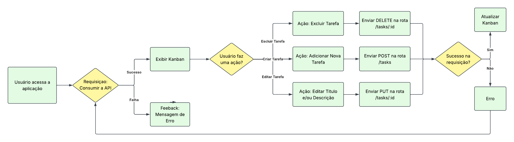
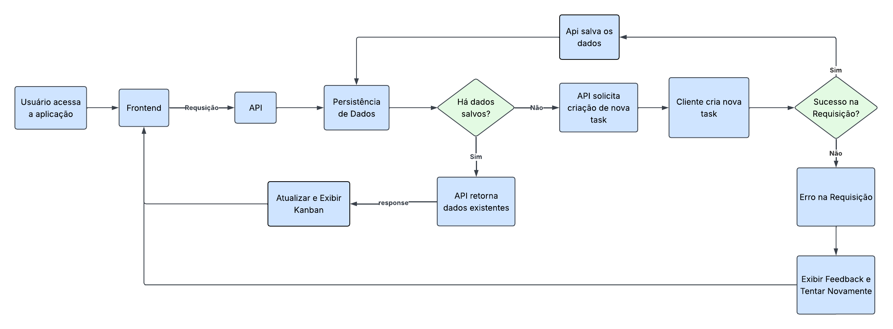

# Mini Kanban de Tarefas — Desafio Fullstack | Veritas
    
Aplicação fullstack de um **Kanban simples**, com o backend em **Golang** e o frontend em **React** usando o **Vite** como parte do desafio prático do processo seletivo da Veritas.

---
### User Flow

O fluxo do usuário detalha a jornada e as interações na interface:



### Data flow

O fluxo de dados ilustra a comunicação entre a interface do usuário e o servidor:



---
## Estrutura do Projeto

``` text
desafio-fullstack-veritas/
├── backend/                 # Código fonte da API em Golang
│   ├── main.go              # Ponto de entrada da aplicação Go
│   ├── go.mod               # Dependências do Go
│   └── ...
│
├─── frontend/               # Código fonte da interface em React
│    ├── src/                # Componentes, páginas e estilos
│    ├── package.json        # Dependências e scripts do Node
│    └── ...
├── docs/                    # Documentação - Diagrama do User Flow e Data Flow
└── README.md
```

## Como Rodar a Aplicação

O projeto está dividido em duas partes principais: `backend` e `frontend`. Você precisará rodar ambos simultaneamente em terminais separados.

### 1. Rodando o Backend (Golang/Gin)

1. Abra um terminal e navegue até a pasta do backend:
   
   ```bash
   cd backend
2. Instale as dependência do Go:
   ```bash
   go mod tidy
3. Inicie o servidor
    ```bash
    go run .
O servidor backend deverá iniciar em http://localhost:8000/tasks.

---
### 2. Rodando o Frontend (React - Vite)

1. Abra um novo terminal e navegue até a pasta do frontend:
    
    ```bash
    cd frontend
2. Instale as dependências do projeto

    ```bash
    npm install
3. Inicie o servidor de desenvolvimento:
    ```bash
    npm run dev
O frontend deverá iniciar e abrir automaticamente no seu navegador em http://localhost:5173

---

## Tecnologias Utilizadas

### `Backend`

| Requisitios | Descrição |
|-------------|-----------|
| Linguagem de Programação |  |
| Framework Web | |
| Persistência de Dados | | 

### `Frontend`

| Requisitos | Descrição |
| ---------- | ---------- |
| Build Tool |  |
| Biblioteca / Linguagem |   |
| Estilização |  |

---
## Decisões Técnicas

Durante o desenvolvimento do projeto, as seguintes escolhas arquiteturais e de ferramentas foram tomadas para garantir simplicidade, performance e uma boa experiência de uso:

### Backend (Golang)
* **Gin + `net/http` Nativo:** Optei por uma abordagem híbrida, utilizando o framework **Gin** para acelerar a criação de rotas e facilitar a aplicação de middlewares, mantendo a compatibilidade e extraindo o melhor das bibliotecas nativas de HTTP do Go.
* **Armazenamento Simplificado:** Para facilitar a execução e avaliação do projeto — eliminando a necessidade de configurar bancos de dados externos ou Docker —, os dados são gerenciados através de armazenamento local/em memória, interagindo diretamente com o pacote nativo `os`.
* **Gerenciamento de CORS:** Foi implementado um middleware específico para a liberação do **CORS** (Cross-Origin Resource Sharing), garantindo que as requisições do frontend (rodando no Vite) sejam aceitas pelo servidor Go sem bloqueios de segurança do navegador.

### Frontend (React)
* **Ecossistema Vite + React:** A escolha do **Vite** como *bundler* se deu pela sua extrema velocidade de inicialização e *Hot Module Replacement* (HMR), aliado ao React puro para construir uma interface componentizada, leve e sem o excesso de frameworks complexos.
* **Foco em UI/UX Design:** O desenvolvimento visual não foi improvisado. A interface foi previamente desenhada e prototipada no **Figma**, garantindo o alinhamento com padrões modernos de usabilidade e um design limpo.
* **Interatividade com Drag-and-Drop:** Para entregar uma experiência Kanban autêntica e fluida (semelhante a ferramentas de mercado), implementei a movimentação de tarefas via *arrastar e soltar*, tornando a gestão do fluxo de trabalho muito mais intuitiva.